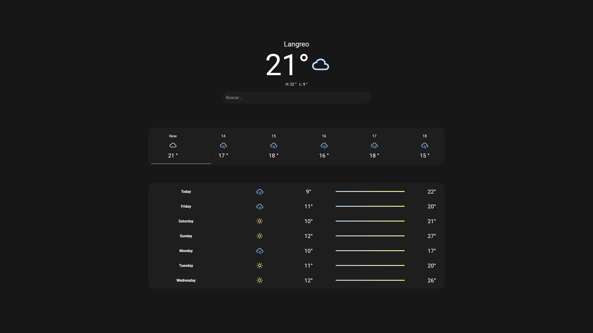
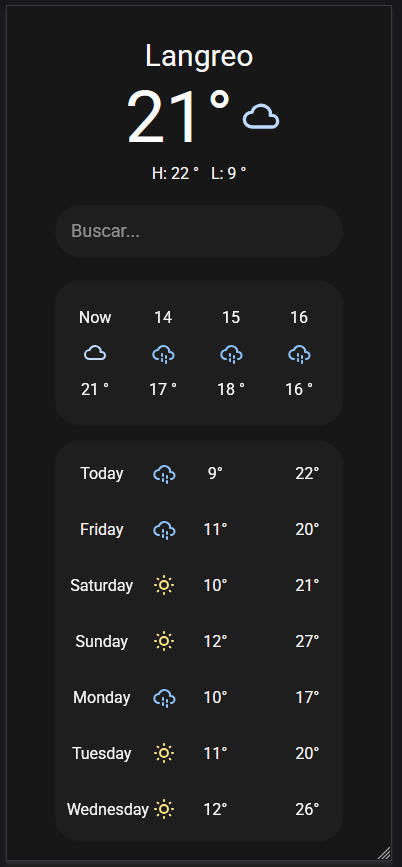

# 🌦️ Weather Web Project

Weather web project created with **React + Vite** by **Iván Márquez García**.  
This application provides real-time and forecast weather information using data from the [WeatherAPI](https://www.weatherapi.com/docs/).

It is fully **responsive**, so it works well on both desktop and mobile devices. Users can search for cities using the search bar, and by pressing Enter, the application dynamically updates the forecast for the selected location.

---

## 🚀 Features

- **Current Weather**: Display of temperature, condition, humidity, wind speed and more.
- **24-Hour Forecast**: Shows the weather for the next 24 hours, starting from the current time.
- **7-Day Forecast**: Overview of upcoming days with icons, max/min temperature, and conditions.
- **Dynamic Icons**: Weather conditions are mapped to custom icons using [Tabler Icons](https://tabler-icons.io/).
- **Responsive Design**: Layout adapts to different screen sizes for optimal usability.
- **City Search**: Users can type a city name in the search bar and press Enter to update the forecast dynamically.

---

## 🛠️ Tech Stack

- [React](https://reactjs.org/) – UI library
- [Vite](https://vitejs.dev/) – Development bundler
- [TailwindCSS](https://tailwindcss.com/) – Styling
- [Tabler Icons React](https://tabler-icons.io/) – Weather & UI icons
- [WeatherAPI](https://www.weatherapi.com/) – Data provider

---

## 📂 Project Structure

```bash
src/
 ├── components/       # Reusable UI components (Forecast, Hourly, etc.)
 ├── utils/            # Helper functions (date parsing, icon mapping...)
 ├── App.jsx           # Main app entry point
 └── main.jsx          # Vite entry point

```

---

## ⚡ How to Run the Project

1. Clone the repository:
   git clone https://github.com/Ivanmg10/palmweather.git
   cd palmweather

2. Install dependencies:
   npm install

   # or

   yarn install

3. Start the development server:

   npm run dev

   # or

   yarn dev

4. Open in browser:
   The app will be available at http://localhost:5173

5. Search for a city:
   Type the city name in the search bar and press Enter to dynamically update the forecast.

---

## 📸 Screenshots

Desktop View



Mobile View



---

## 🔮 Future Improvements

Implement dark/light theme toggle.

Add geolocation feature to detect user location automatically.

Support more languages for international users.
