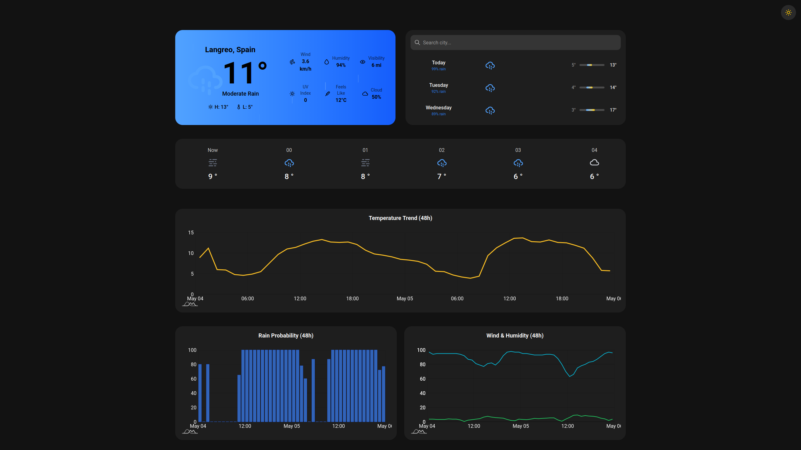

# 🌦️ PalmWeather

Weather web application created with **React + Vite** by **Iván Márquez García**.  
Real-time and forecast weather data from [WeatherAPI](https://www.weatherapi.com/docs/).

Fully **responsive** and **PWA-enabled** with offline support.

---

## 🚀 Features

- **Current Weather** - Temperature, condition, wind, humidity, UV, visibility, cloud cover
- **7-Day Forecast** - Daily max/min temps, icons, rain probability
- **48-Hour Temperature Chart** - Interactive line chart with amCharts5
- **Rain Probability Chart** - Bar chart showing precipitation chances
- **Wind & Humidity Chart** - Dual-axis line chart
- **Weather Animations** - Dynamic effects for rain, snow, sun, moon, clouds, storm
- **City Search** - Autocomplete dropdown with animated suggestions
- **Dark/Light Mode** - Toggle with localStorage persistence
- **PWA Support** - Offline caching, installable app
- **SEO Optimized** - Meta tags, Open Graph, Twitter Cards
- **Geolocation** - Auto-detect user location
- **Accessible** - ARIA labels, semantic HTML

---

## 🛠️ Tech Stack

- [React](https://reactjs.org/) – UI library
- [Vite](https://vitejs.dev/) – Development bundler
- [TailwindCSS](https://tailwindcss.com/) – Styling
- [amCharts5](https://www.amcharts.com/) – Charts
- [Framer Motion](https://www.framer.com/motion/) – Animations
- [Tabler Icons](https://tabler-icons.io/) – Icons
- [Vite PWA](https://vite-pwa.dev/) – PWA plugin
- [WeatherAPI](https://www.weatherapi.com/) – Weather data

---

## 📂 Project Structure

```bash
src/
├── components/
│   ├── today/           # Current weather with animations
│   ├── forecast/        # 7-day forecast with search
│   ├── temperature/     # Hourly temperature
│   ├── temperatureChart/
│   ├── rainChart/
│   └── windHumidityChart/
├── hooks/               # Custom hooks (useLocationName)
├── pages/               # Loading, Error pages
├── utils/               # IconUtils, DateUtils
├── App.jsx              # Main app
└── main.jsx             # Entry point
```

---

## ⚡ How to Run

1. **Clone the repository:**
   ```bash
   git clone https://github.com/Ivanmg10/palmweather.git
   cd palmweather
   ```

2. **Install dependencies:**
   ```bash
   npm install
   ```

3. **Start development server:**
   ```bash
   npm run dev
   ```

4. **Open in browser:**
   ```
   http://localhost:5173
   ```

5. **Build for production:**
   ```bash
   npm run build
   ```

---

## 📸 Preview

Responsive design with dark/light theme support.



---

## 🔧 Environment Variables

Create a `.env` file in the root directory:

```env
VITE_WEATHER_API_KEY=your_api_key_here
```

Get a free API key from [WeatherAPI](https://www.weatherapi.com/).

---

## 📄 License

MIT